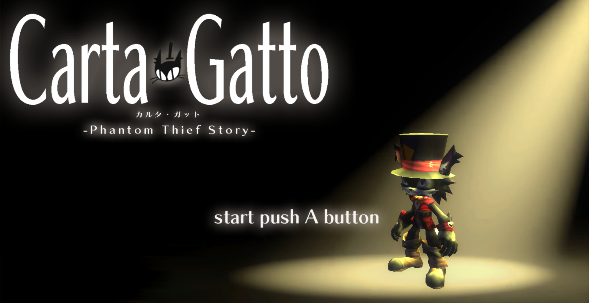
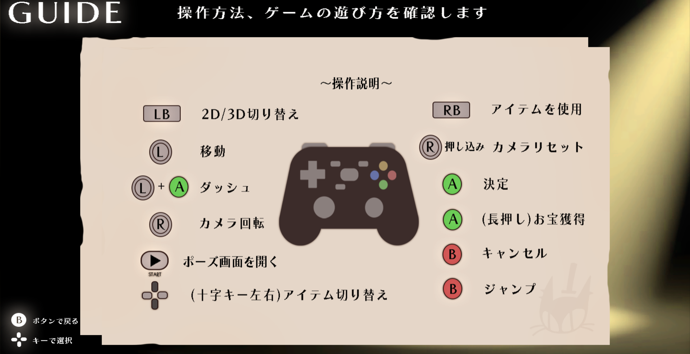

# Carta Gatto

  

  

---

# 目次

  + [Carta Gatto](#anchor1)
  + [目次](#anchor2)
  + [概要](#anchor3)
  + [操作方法](#anchor4)
  + [制作環境](#anchor5)
  + [担当箇所](#anchor6)
  + [技術紹介](#anchor7)
    + [UVアニメーション](#anchor8)
    + [ブルーム](#anchor9)
    + [シャドウイング](#anchor10)
    + [輪郭線](#anchor11)
    + [ディザリング](#anchor12)
    + [ワイプ](#anchor13)
    + [Singleton](#anchor14)

  

---

# 概要

  + 制作期間 
    2023年2月～5月

 

  + 制作人数 
    4人

 

  + ジャンル 
    アクション・ステルスゲーム

 

  + プレイ人数 
    1人

 

  + 対応ハード 
    windows11

  

---

# 操作方法

  + Aボタン
    + 決定
    + ダッシュ
    + お宝獲得(長押し)

 

  + Bボタン
    + キャンセル
    + ジャンプ

 

  + Lボタン
    + 2D/3D切り替え

 

  + Rボタン
    + アイテム使用

 

  + Lスティック
    + 移動
  
 

  + Rスティック
    + カメラ回転
    + プレイヤーの方向へ向く(押し込み)

 

  + 十字キー
    + 閃光弾を選択(左キー)
    + 音爆弾を選択(右キー)

 

  + Startボタン
    + ポーズ画面を開く

  

---

# 制作環境

  + **使用ツール** 
    Visual Studio 2022 
    Visual Studio Code 
    3ds Max 2023 
    Adobe Photoshop 2022 
    Effekseer 
    fork 
    Github 

 

  + **使用言語** 
    C++ 
    HLSL 

  

---

# 担当箇所

  **作成したコード**
  
  

.cpp .h

  + 

BookEngine

    + CollisionObject.cpp
    + CollisionObject.h
    + DirectionLight.cpp
    + DirectionLight.h
    + HemiSphereLight.cpp
    + HemiSphereLight.h
    + PointLight.cpp
    + PointLight.h
    + SpotLight.cpp
    + SpotLight.h
    + Bloom.cpp
    + Bloom.h
    + FontRender.cpp
    + FontRender.h
    + IRenderer.h
    + ModelRender.cpp
    + ModelRender.h
    + RenderingEngine.cpp
    + RenderingEngine.h
    + SpriteRender.cpp
    + SpriteRender.h
    + Level2DRender.cpp
    + Level2DRender.h
    + LevelRender.cpp
    + LevelRender.h
    + SkyCube.cpp
    + SkyCube.h
    + BookEngine.cpp
    + BookEngine.h
    + BookEnginePreCompile.cpp
    + BookEnginePreCompile.h

    

  + 

Game

  
    + LightSensor.cpp
    + LightSensor.h
    + Object.cpp
    + Object.h
    + SecurityCamera.cpp
    + SecurityCamera.h
    + Sensor.cpp
    + Sensor.h
    + Event.cpp
    + Event.h
    + Opening.cpp
    + Opening.h
    + Result.cpp
    + Result.h
    + Title.cpp
    + Title.h
    + Title_Guide.cpp
    + Title_Guide.h
    + Title_Setting.cpp
    + Title_Setting.h
    + Painting.cpp
    + Painting.h
    + CountDown.cpp
    + CountDown.h
    + Fade.cpp
    + Fade.h
    + GoalSprite.cpp
    + GoalSprite.h
    + Logo.cpp
    + Logo.h
    + Minimap.cpp
    + Minimap.h
    + Pause.cpp
    + Pause.h
    + Wipe.cpp
    + Wipe.h
    + GameManager.cpp
    + GameManager.h

  

.fx

  + lighting_CB.h
  + model.fx
  + model_register.h
  + postEffect.fx
  + shadowMap.fx
  + SkyCubeMap.fx
  + sprite.fx
  + volumeLight.fx
  + zprepass.fx

 

  **改造したエンジンコード**

  

.cpp .h

  + GameObjectManager.cpp
    + ゲームオブジェクトを全停止する機能の追加(41行目～)
  + EffectEngine.h
    + エフェクトの再生速度を変更する機能の追加(86行目)
  + Effect.h
    + 同上。EffectEmitter->Effect->EffectEngineクラスへと値を順に渡している(95行目)
  + RenderContext.h
    + ビューポートのみの設定を行うSetViewPort関数を追加(83行目)
  + GamePad.h
    + ボタンを離したかどうかを判定するGetKeyUp関数の追加(100行目)

  

  

---

# 技術紹介

+ ## UVアニメーション
  
  

  2D状態のプレイヤーは、全てのアニメーションを配置した画像を一枚の板ポリゴンに貼り、uv座標を変更することでアニメーションを実現しています。

 

+ ## ブルーム

+ ## シャドウイング

+ ## 輪郭線

+ ## ディザリング

+ ## ワイプ

+ ## Singleton