
# Carta Gatto

  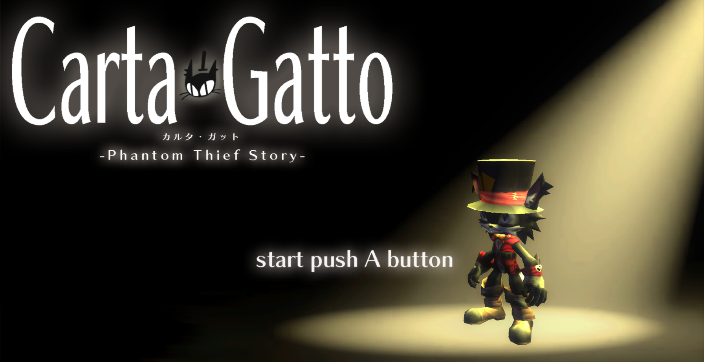

  

---

# 目次

  + [Carta Gatto](#anchor1)
  + [目次](#anchor2)
  + [概要](#anchor3)
  + [操作方法](#anchor4)
  + [制作環境](#anchor5)
  + [担当箇所](#anchor6)
  + [技術紹介](#anchor7)
    + [UVアニメーション](#anchor8)
    + [ブルーム](#anchor9)
    + [シャドウイング](#anchor10)
    + [輪郭線](#anchor11)
    + [ディザリング](#anchor12)
    + [ワイプ](#anchor13)
  + [リファクタリング](#anchor15)
    + [マジックナンバーの除去](#anchor16)
    + [const修飾子の追加](#anchor17)
    + [初期化子の追加](#anchor18)

  

---

# 概要

  + 実績 
  日本ゲーム大賞 2023 アマチュア部門 一次審査 通過

  + 制作期間 
    2023年2月～5月

 

  + 制作人数 
    4人

 

  + ジャンル 
    アクション・ステルスゲーム

 

  + プレイ人数 
    1人

 

  + 対応ハード 
    windows11

  

---

# 操作方法

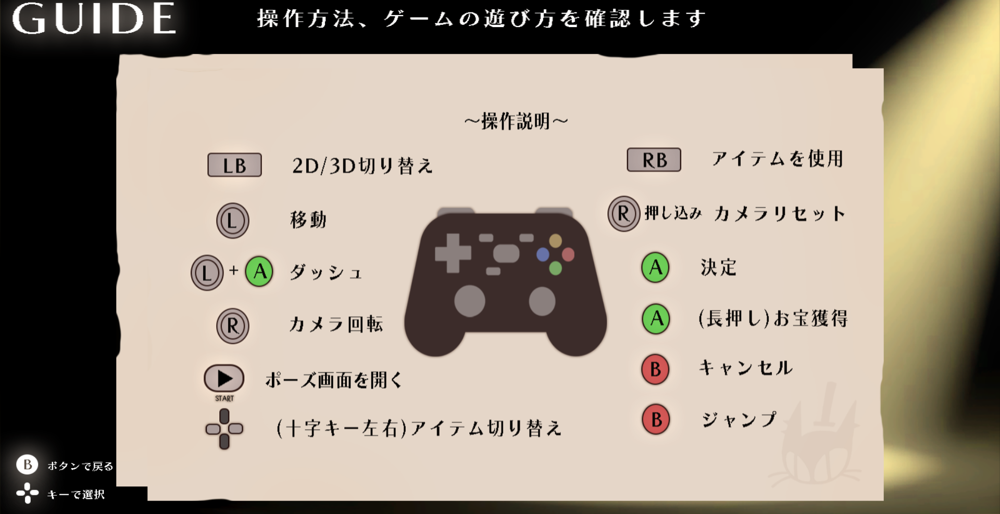

  + Aボタン
    + 決定
    + ダッシュ
    + お宝獲得(長押し)

 

  + Bボタン
    + キャンセル
    + ジャンプ

 

  + Lボタン
    + 2D/3D切り替え

 

  + Rボタン
    + アイテム使用

 

  + Lスティック
    + 移動
  
 

  + Rスティック
    + カメラ回転
    + プレイヤーの方向へ向く(押し込み)

 

  + 十字キー
    + 閃光弾を選択(左キー)
    + 音爆弾を選択(右キー)

 

  + Startボタン
    + ポーズ画面を開く

  

---

# 制作環境

  + **使用ツール** 
    Visual Studio 2022 
    Visual Studio Code 
    3ds Max 2023 
    Adobe Photoshop 2022 
    Effekseer 
    fork 
    Github 

 

  + **使用言語** 
    C++ 
    HLSL 

  

---

# 担当箇所

  **作成したコード**
  
  

.cpp .h

  + 

BookEngine

    + CollisionObject.cpp
    + CollisionObject.h
    + DirectionLight.cpp
    + DirectionLight.h
    + HemiSphereLight.cpp
    + HemiSphereLight.h
    + PointLight.cpp
    + PointLight.h
    + SpotLight.cpp
    + SpotLight.h
    + Bloom.cpp
    + Bloom.h
    + FontRender.cpp
    + FontRender.h
    + IRenderer.h
    + ModelRender.cpp
    + ModelRender.h
    + RenderingEngine.cpp
    + RenderingEngine.h
    + SpriteRender.cpp
    + SpriteRender.h
    + Level2DRender.cpp
    + Level2DRender.h
    + LevelRender.cpp
    + LevelRender.h
    + SkyCube.cpp
    + SkyCube.h
    + BookEngine.cpp
    + BookEngine.h
    + BookEnginePreCompile.cpp
    + BookEnginePreCompile.h

    

  + 

Game

  
    + LightSensor.cpp
    + LightSensor.h
    + Object.cpp
    + Object.h
    + SecurityCamera.cpp
    + SecurityCamera.h
    + Sensor.cpp
    + Sensor.h
    + Event.cpp
    + Event.h
    + Opening.cpp
    + Opening.h
    + Result.cpp
    + Result.h
    + Title.cpp
    + Title.h
    + Title_Guide.cpp
    + Title_Guide.h
    + Title_Setting.cpp
    + Title_Setting.h
    + Painting.cpp
    + Painting.h
    + CountDown.cpp
    + CountDown.h
    + Fade.cpp
    + Fade.h
    + GoalSprite.cpp
    + GoalSprite.h
    + Logo.cpp
    + Logo.h
    + Minimap.cpp
    + Minimap.h
    + Pause.cpp
    + Pause.h
    + Wipe.cpp
    + Wipe.h
    + GameManager.cpp
    + GameManager.h

  

.fx

  + lighting_CB.h
  + model.fx
  + model_register.h
  + postEffect.fx
  + shadowMap.fx
  + SkyCubeMap.fx
  + sprite.fx
  + volumeLight.fx
  + zprepass.fx

 

  **改造したエンジンコード**

  

.cpp .h

  + GameObjectManager.cpp
    + ゲームオブジェクトを全停止する機能の追加(41行目～)
  + EffectEngine.h
    + エフェクトの再生速度を変更する機能の追加(86行目)
  + Effect.h
    + 同上。EffectEmitter->Effect->EffectEngineクラスへと値を順に渡している(95行目)
  + RenderContext.h
    + ビューポートのみの設定を行うSetViewPort関数を追加(83行目)
  + GamePad.h
    + ボタンを離したかどうかを判定するGetKeyUp関数の追加(100行目)

  

  

---

# 技術紹介

+ ## **UVアニメーション**
  
  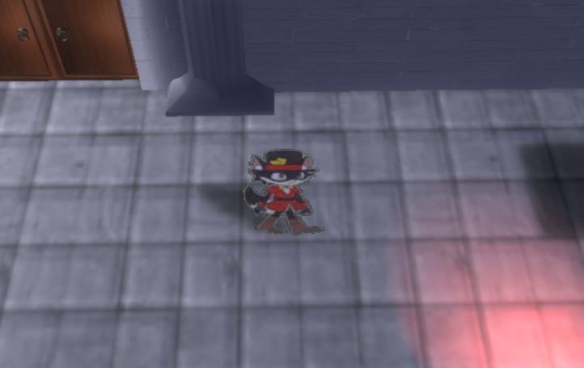

  2D状態のプレイヤーは、全てのアニメーションを配置した画像を一枚の板ポリゴンに貼り、  
  表示したいアニメーション番号を定数バッファに値を入れ、  
  その値を元にuv座標を計算することでアニメーションを実現しています。  

  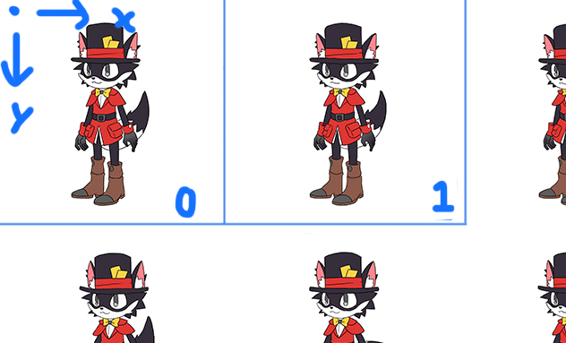

 

+ ## **川瀬式ブルーム**
  このエンジンでは、高速で高品質な処理を実現できる川瀬式ブルームを採用しています。  
  通常のブルーム処理は、輝度テクスチャをぼかす処理が一回のみですが、川瀬式では複数回ガウシアンブラーをかけ、それらを合成することで質の高いブルームを表現できます。
  
  1. モデルから輝度抽出を行う。
   
  2. 輝度抽出した画像からダウンサンプリングを行い、ガウシアンブラーをかける。
   
  3. 作られた画像から2の工程をする、を複数回行う。

  4. 複数枚の画像をシーンに加算合成する。

  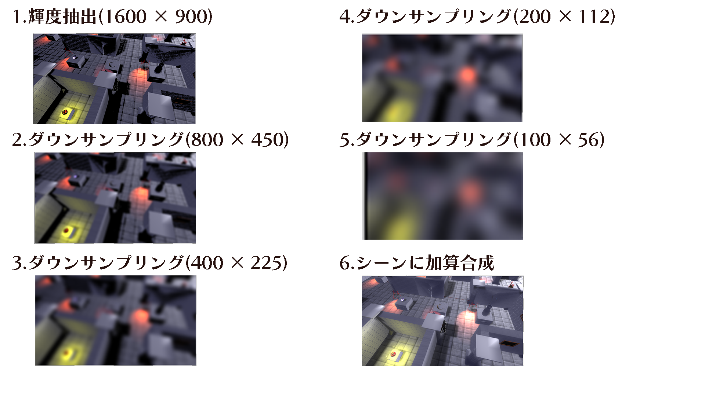

  ▼ブルーム実装前
  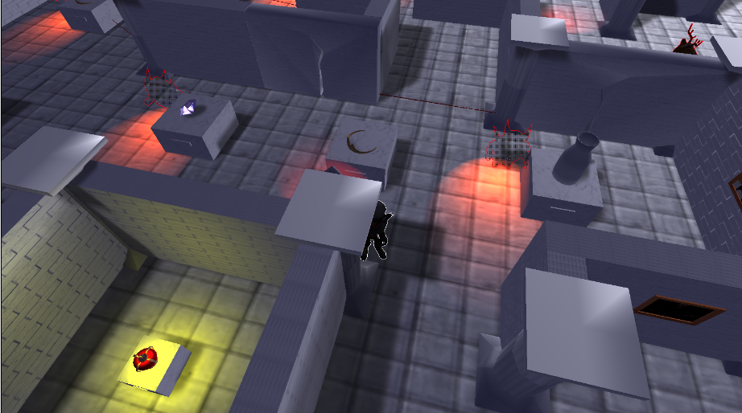

  ▼ブルーム実装後
  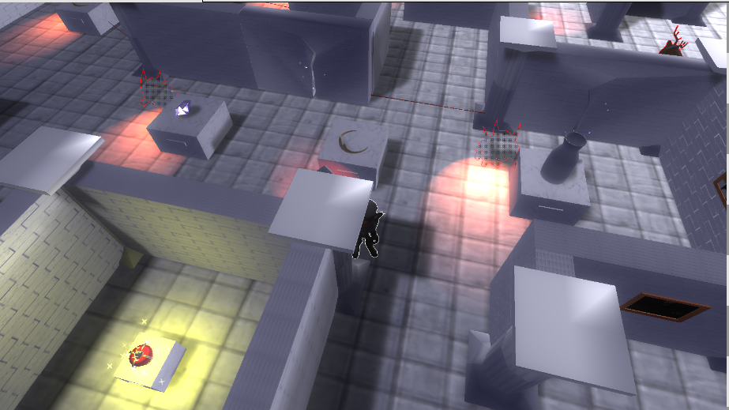

 

+ ## **VSM(分散シャドウマップ)**
  VSM(Variance Shadow Map)とは、シャドウマップに書き込まれた「深度値の局所的な分散」を利用してシャドウを実現するアルゴリズムです。  
  局所的な分散とは、シャドウマップをグリッド状にしたときのグループごとの分散で、分散が大きいということは、グループ内の深度値の幅が広いということになります。  
  この分散が大きい部分が影の境界線になるので、影を薄くしてジャギーを目立たないようにする手法がVSMです。  

  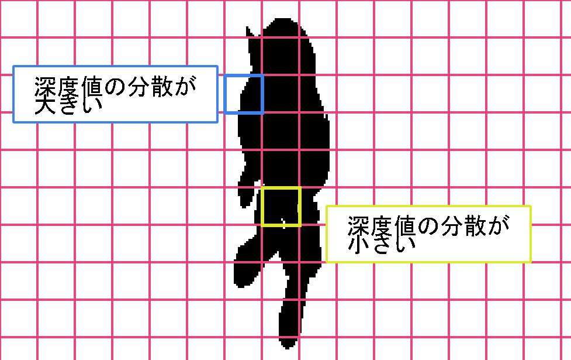
  
  1. シャドウマップにライトから見たピクセルの距離(深度値)と、その二乗を書き込む。
  2. グループごとの深度値と深度値の二乗の平均を求め、ガウシアンブラーをかける。これでシャドウマップが出来上がる。
  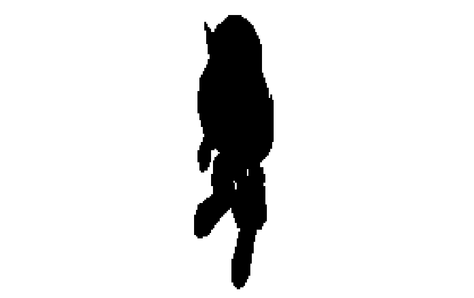

  3. 光が届く確率を、チェビシェフの不等式を用いて計算する。
  4. シャドウマップに書き込まれている値からグループの分散を求めて、変数varianceに記録する。
  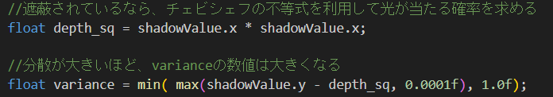

  5. このグループの平均深度値との差を求め、変数mdに記録する。
  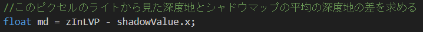

  6. varianceとmdを使用して光が届く確率を計算する。
  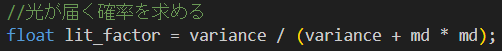

  7. 通常カラーとシャドウカラーを線形補間する。
  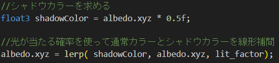

 

+ ## **輪郭線**
  このゲームではプレイヤーやエネミーを強調するために輪郭線を実装しています。  
  一般的な輪郭線はポストエフェクトの処理で行いますが、シーン全体に輪郭線が発生したり、輪郭線の色が同じになる問題が発生します。  
  今回は、特定の目立たせたいモデルにのみ、色を分けて実装したいので、フォワードレンダリングによる輪郭線を実装しました。

  1.モデルのプロジェクション空間の深度値をテクスチャに書き込み、持ってくる。

  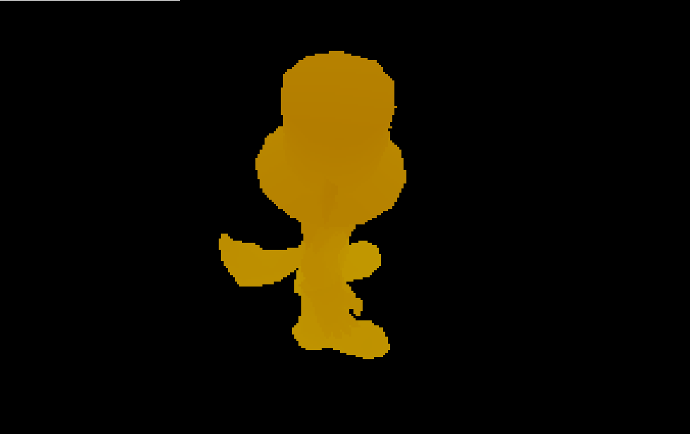

  2.今から描画するテクセルの深度値と、近傍8テクセルの深度値の平均を比較し、差が一定以上なら、輪郭線を描画する。

  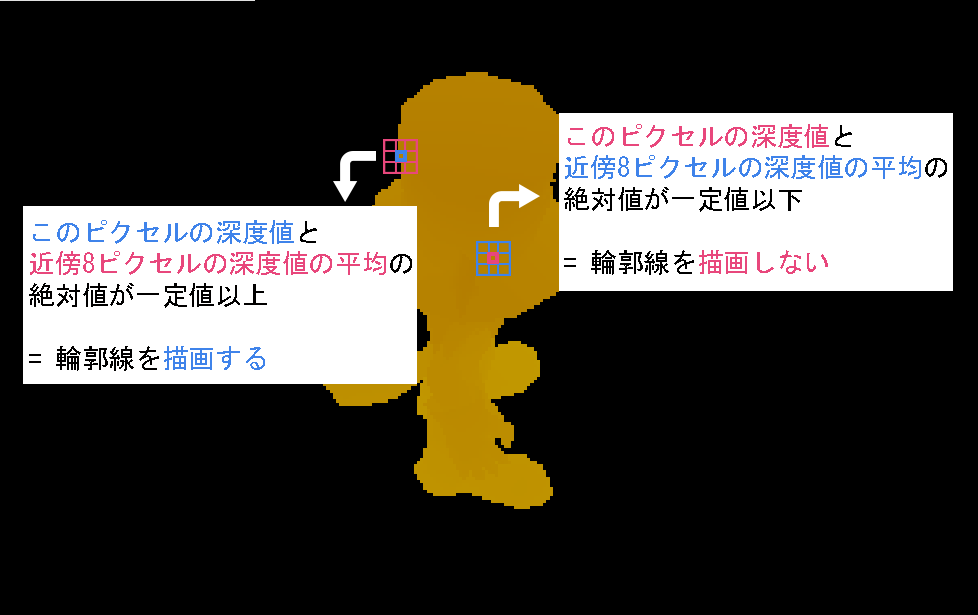

  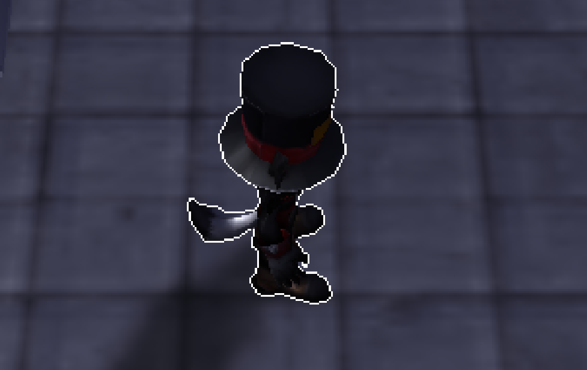

 

+ ## **ディザリング**
  「探索時にステルス状態になる敵」を追加するためにディザリングを実装しました。  
  ディザリングとは一部のピクセルをディザパターンに従って描画しないようにする処理で、これにより、不透明オブジェクトを半透明っぽく表現することが出来ます。  

  1.ディザパターンと呼ばれる4x4の二次元配列を定義する。  
    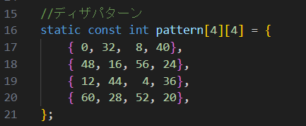  

  2.ピクセルのスクリーン座標系のX座標とY座標4で割った余りを計算し、0～3の値を返す。  
    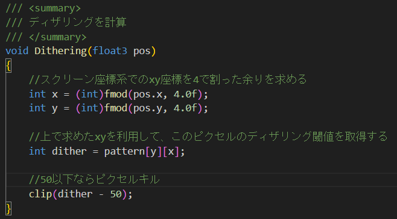  

  3.2で求めた値を使ってディザパターン配列から閾値を取得し、一定値以下ならピクセルキルを行う。
    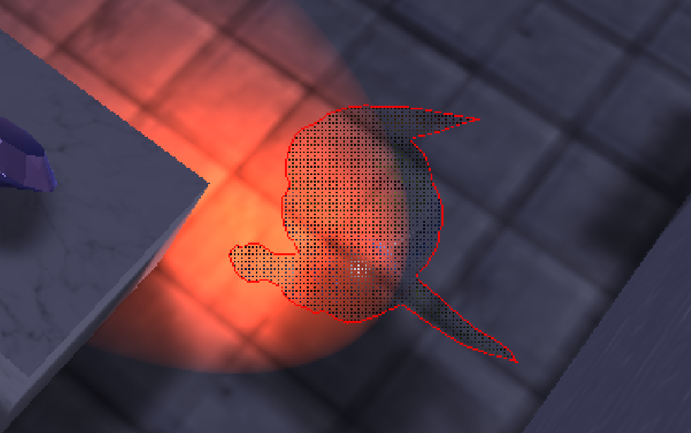  
 

+ ## **ビューポート**
  警戒度レベルが上がったとき左下に表示されるワイプは、ビューポートを追加して実装しています。

    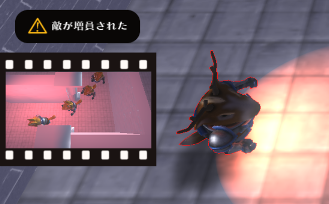  

  ステージ外に地形を生成し、それをカメラに写すことでワイプを表現している。

    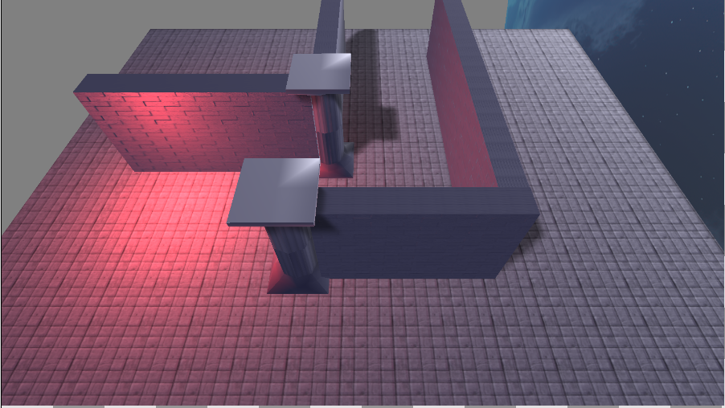  

  通常モデルとは別にワイプ用のモデルとカメラを設定し、ビューポートを切り替えて描画している。

  ▼ワイプ用の描画実行処理(赤色)と、通常の描画実行処理(青色)
    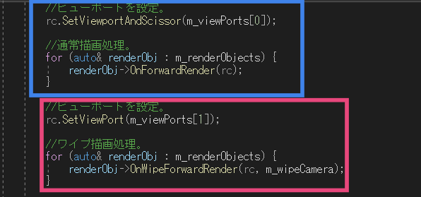  

  

---

# リファクタリング

+ ## **マジックナンバーの除去**

  マジックナンバーとはプログラム内に直に記述された数字で、書いた本人にしかその数字にした意図がわからなくなり、また、忘れてしまうことで本人も読めなくなり、コードの可読性を下げてしまいます。  
  他にも、マジックナンバーを使うことで、同じ数値を変更する際に一つずつ変更する必要があったり、コードの海を行き来して該当箇所を探す必要があります。  
  そこで、定数として名前空間に定義することで、これらの問題を解決し、コードの可読性、保守性を上げることが出来ます。
  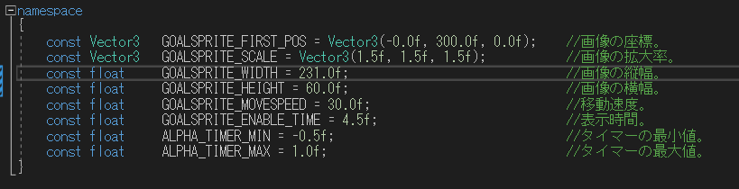  

 

+ ## **const修飾子の追加**

  誤って参照渡しした値を変更したり、関数内のメンバ変数を変更したりするのを防ぐために、const修飾子を付けました。

  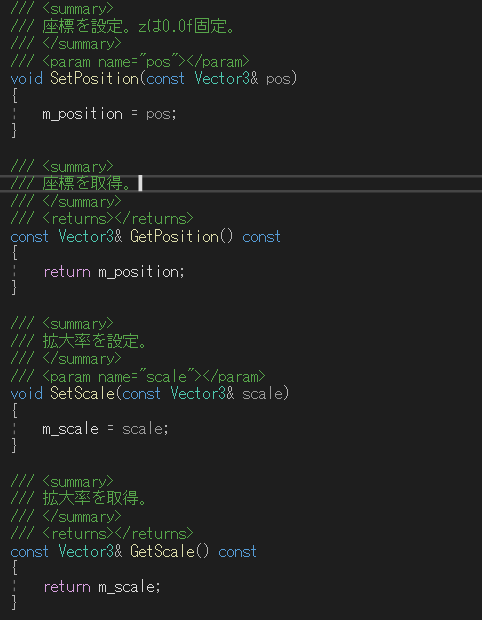  

  しかし、変数を変更する可能性のある既存のオブジェクトには付けないようにしなければなりません。  
  また、constオブジェクトはconst関数しか呼べないので注意が必要です。

 

+ ## **初期化子の追加**

  宣言した変数は、未初期化状態ではどんな値が入っているか不明で、そのまま使用すると予期せぬ動作やエラーを招いてしまいます。  
  万が一の事態を想定して、変数の初期化や値を入れてから使用するよう気をつけました。

  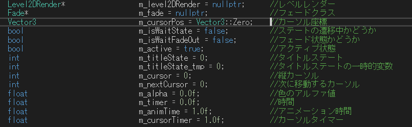  

 

